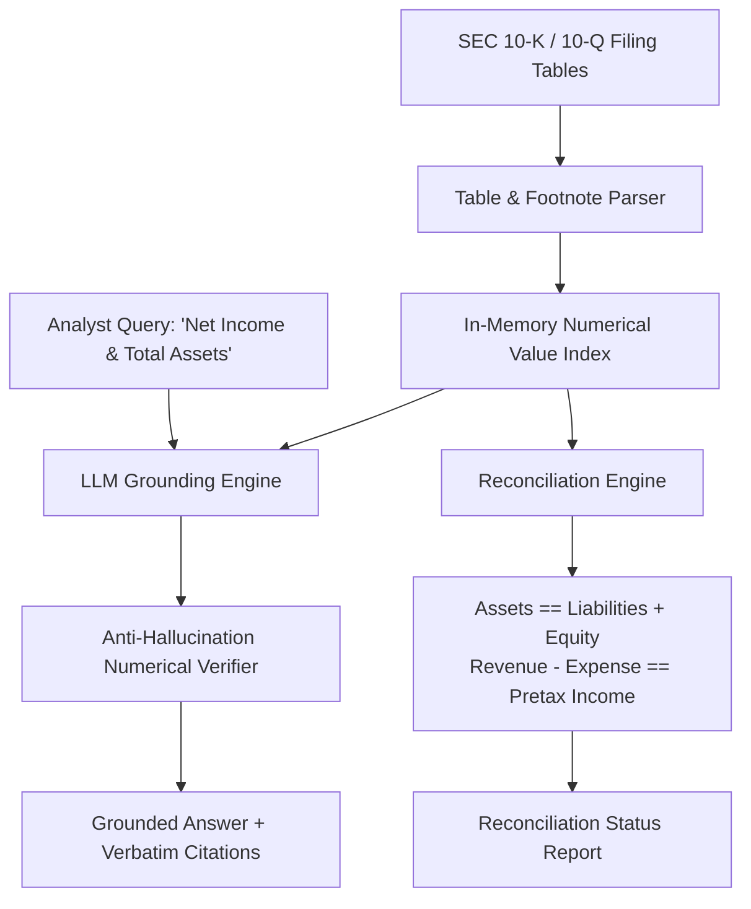

# JPMC DocIntel API: SEC 10-K & Financial Statement Grounding Engine

[](https://fastapi.tiangolo.com)
[](https://python.org)
[](https://docs.pydantic.dev)
[](https://www.jpmorgan.com)

A production-grade **FastAPI document intelligence microservice** engineered for **JPMorgan Chase's LLM Suite**. It solves the critical problem of numerical hallucinations and footnote omissions in financial statement analysis by enforcing **deterministic tabular grounding** and **GAAP accounting identity reconciliation**.

---

## Architecture Overview



---

## Core Capabilities

1. **Tabular & Footnote RAG**: Extracts balance sheets, income statements, and cash flow statements with column-level awareness and footnote cross-referencing.
2. **Deterministic Anti-Hallucination Pass**: Scans candidate generated answers and mathematically verifies that every statistic, dollar amount, or percentage exists verbatim in the verified SEC tables.
3. **Automated Accounting Reconciliation**: Automatically runs programmatic checks on core accounting identities ($Assets = Liabilities + Equity$) to flag internal filing discrepancies or extraction errors before analyst consumption.

---

## API Endpoints Reference

| Method | Endpoint | Description |
| :--- | :--- | :--- |
| `GET` | `/health` | Health status and list of indexed filings |
| `POST` | `/api/v1/filings/ingest` | Ingests a new SEC filing with structured tables |
| `POST` | `/api/v1/filings/query` | Queries financial statements with verbatim citations & anti-hallucination checks |
| `POST` | `/api/v1/filings/reconcile` | Executes programmatic GAAP balance sheet and income statement identity verification |

---

## Quickstart

```bash
# Run tests
python JPMC_DocIntel_API/test_api.py

# Launch FastAPI microservice on Port 8001
uvicorn JPMC_DocIntel_API.main:app --host 0.0.0.0 --port 8001 --reload
```
Interactive OpenAPI Swagger docs will be live at: **`http://127.0.0.1:8001/docs`**.

---

## 🎯 JPMC Senior Associate Interview Defense Guide

When interviewing for the **LLM Suite Senior Associate** opening at JPMorgan Chase (London), use this project to showcase technical depth in **Corporate & Investment Banking (CIB)** AI:

### Question 1: *"Why can't we simply pass SEC 10-K filings into a long-context LLM like Gemini Pro or GPT-4?"*
> **Answer**:
> *"While 1M+ token context windows can swallow an entire 150-page 10-K, standard self-attention mechanisms degrade on nested tabular data and parenthetical negative accounting notations (e.g. `$(1,256)M`).
> Furthermore, in financial research, a 0.5% variance or an omitted footnote regarding Net Interest Income can lead to erroneous investment decisions.
> In my **JPMC DocIntel API**, I architected a two-stage system: structured table parsing into coordinate indexes, followed by a deterministic post-generation numerical verification pass that cross-examines every extracted number against source table coordinates. If any number fails source verification, it is flagged as a hallucination."*

### Question 2: *"How do you handle accounting integrity in your AI pipeline?"*
> **Answer**:
> *"I built a dedicated **Reconciliation Engine** directly into the microservice. When a filing is ingested, before any summary is served to analysts, the engine validates fundamental accounting equations ($Assets = Liabilities + Equity$ and $Pretax Income = Revenue - Expenses - Provisions$). If the tables do not balance within a $1M rounding tolerance, the system flags a discrepancy alert, ensuring model outputs never contradict audited financial realities."*
