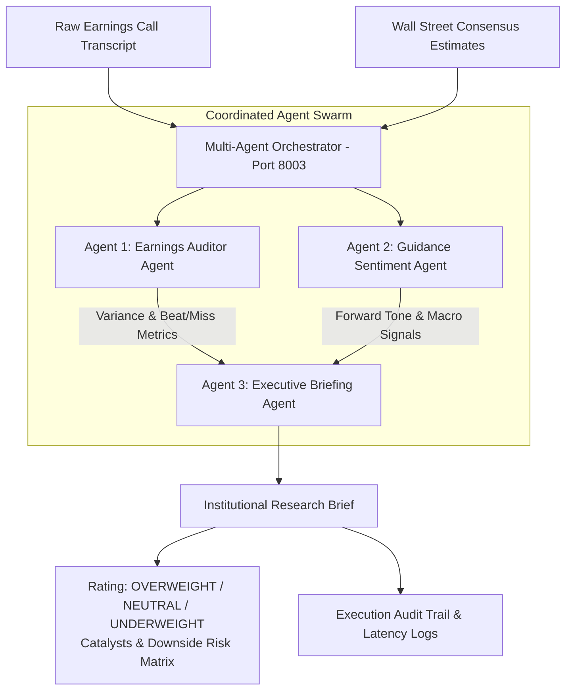

# JPMC Market Synthesizer API: Multi-Agent Earnings & Consensus Synthesis Engine

[](https://fastapi.tiangolo.com)
[](https://python.org)
[](https://docs.pydantic.dev)
[](https://fastapi.tiangolo.com)

A specialized **multi-agent institutional equity research microservice** built for **JPMorgan Chase's LLM Suite**. It solves the problem of high analyst cognitive load during earnings season by coordinating a 3-agent swarm to benchmark consensus estimates, extract qualitative forward-looking guidance, and synthesize an investment stance in sub-second latency.

---

## Multi-Agent Architecture



---

## 3 Specialized Agents

1. **Earnings Auditor Agent (`EarningsAuditorAgent`)**:
   - Compares reported EPS, Net Revenue, and business unit fees against consensus estimates.
   - Computes basis point / percentage variances and categorizes each as `BEAT`, `IN_LINE`, or `MISS`.
2. **Guidance Sentiment Agent (`GuidanceSentimentAgent`)**:
   - Parses executive management remarks for forward-looking guidance (NII trajectories, noninterest expense targets, Capex commitments).
   - Classifies executive tone into `BULLISH`, `NEUTRAL`, or `CAUTIOUS` using targeted polarity scoring.
3. **Executive Briefing Agent (`ExecutiveBriefingAgent`)**:
   - Consolidates quantitative beats/misses and qualitative guidance into a standardized 1-page institutional research note.
   - Automatically derives investment stance (`OVERWEIGHT`, `NEUTRAL`, `UNDERWEIGHT`) with explicit downside risks and catalysts.

---

## API Endpoints Reference

| Method | Endpoint | Description |
| :--- | :--- | :--- |
| `GET` | `/health` | Service health status and active agents |
| `GET` | `/api/v1/market/demo` | Runs full 3-agent swarm on sample JPMorgan Chase Q4 earnings call |
| `POST` | `/api/v1/market/analyze-earnings` | Accepts custom transcript and consensus data to generate an institutional brief |

---

## Quickstart

```bash
# Run test suite
python JPMC_MarketSynthesizer_API/test_api.py

# Launch FastAPI microservice on Port 8003
uvicorn JPMC_MarketSynthesizer_API.main:app --host 0.0.0.0 --port 8003 --reload
```
Interactive OpenAPI Swagger docs will be live at: **`http://127.0.0.1:8003/docs`**.

---

## 🎯 JPMC Senior Associate Interview Defense Guide

### Question 1: *"Why orchestrate three agents rather than one large zero-shot prompt with a model like Gemini Pro or Claude 3.5 Sonnet?"*
> **Answer**:
> *"Passing an entire 15,000-word earnings call transcript into a single zero-shot prompt produces several critical failures in banking:
> 1. **Instruction Drift & Attention Washout**: The model conflates GAAP with non-GAAP exclusions (e.g. FDIC special assessment fees vs core EPS).
> 2. **Lack of Explainable Provenance**: When an analyst questions why an investment stance is 'Neutral', a monolithic LLM provides subjective justifications.
> In my **JPMC Market Synthesizer API**, I decomposed the task into a deterministic quantitative auditor agent and a qualitative guidance extractor. The briefing agent operates only on the validated outputs of the upstream specialists, guaranteeing that the investment rating directly reflects mathematical variance and verifiable executive guidance."*

### Question 2: *"How would this microservice integrate with JPMorgan's trading desks and Portfolio Managers?"*
> **Answer**:
> *"During quarterly earnings releases at 7:00 AM EST, portfolio managers have under 5 minutes before the opening bell to decide on rebalancing.
> This microservice accepts real-time audio transcripts streaming from S&P Capital IQ or FactSet, processes the 3-agent pipeline asynchronously in sub-second time, and pushes a structured JSON payload to the trader's desktop terminal or internal Bloomberg chat bot with exact variance tables and risk vectors."*
