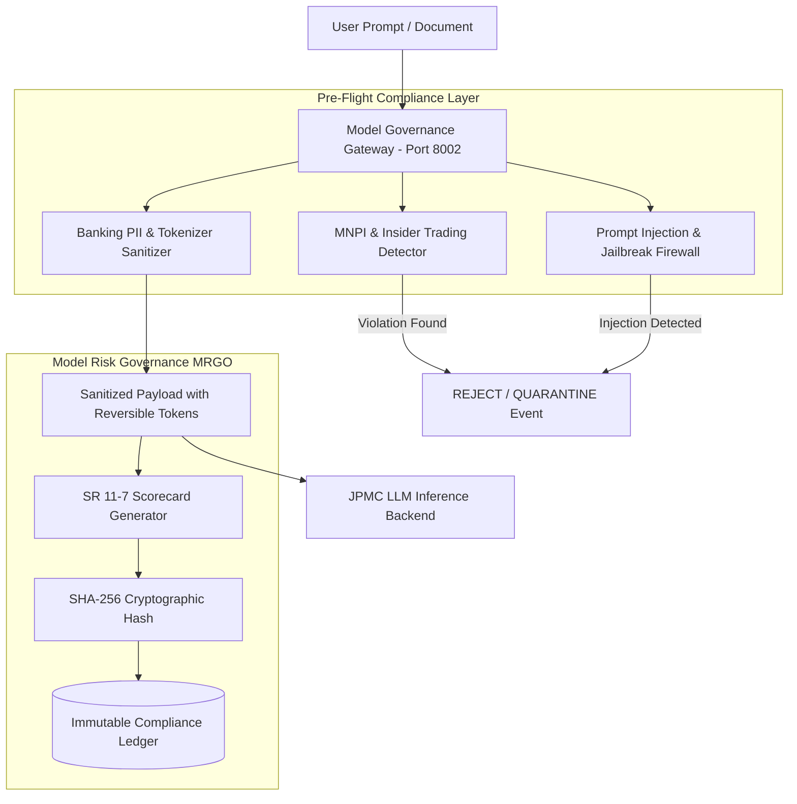

# JPMC Model Governance API: SR 11-7 AI Safety, MNPI & Regulatory Audit Gateway

[](https://fastapi.tiangolo.com)
[](https://python.org)
[](https://docs.pydantic.dev)
[](https://www.federalreserve.gov/supervisionreg/srletters/sr1107.htm)

An enterprise regulatory gateway and AI safety microservice built for **JPMorgan Chase's LLM Suite**. It enforces compliance with **Federal Reserve SR 11-7** (Model Risk Management), UK **FCA/PRA guidelines**, prevents **Material Non-Public Information (MNPI)** leakage, sanitizes UK/Global banking PII, and cryptographically signs model audit trails using SHA-256 hashes.

---

## Architecture Overview



---

## Core Capabilities

1. **MNPI & Information Barrier Enforcement**: Scans prompts and documents for confidential deal codenames (e.g. `Project Falcon`), unannounced M&A actions, and pre-release earnings leaks to prevent insider trading violations.
2. **Banking PII Pseudonymization**: Automatically redacts IBANs, UK National Insurance Numbers (NINO), SWIFT BICs, and credit cards into reversible tokens (`[MASKED_IBAN_1]`), preventing client data exposure to LLMs.
3. **Adversarial Injection Firewall**: Identifies and terminates prompt injections, system prompt exfiltration attempts, and DAN jailbreak patterns.
4. **SR 11-7 Model Risk Scorecard**: Computes quantitative compliance ratings across the 3 core pillars of Federal Reserve SR 11-7 (Conceptual Soundness, Outcome Analysis, Ongoing Monitoring) and signs transactions with SHA-256 lineage hashes.

---

## API Endpoints Reference

| Method | Endpoint | Description |
| :--- | :--- | :--- |
| `GET` | `/health` | Gateway health check and active compliance rules |
| `POST` | `/api/v1/governance/inspect` | Evaluates prompts for MNPI leaks, insider trading, and prompt injection |
| `POST` | `/api/v1/governance/sanitize` | Anonymizes IBANs, UK NINOs, SWIFT BICs, and deal codenames |
| `POST` | `/api/v1/governance/scorecard` | Generates SR 11-7 Model Risk Management evaluation reports |
| `GET` | `/api/v1/governance/audit-trail` | Retrieves immutable audit ledger for internal audit & compliance officers |

---

## Quickstart

```bash
# Run test suite
python JPMC_ModelGovernance_API/test_api.py

# Launch FastAPI microservice on Port 8002
uvicorn JPMC_ModelGovernance_API.main:app --host 0.0.0.0 --port 8002 --reload
```
Interactive OpenAPI Swagger docs will be live at: **`http://127.0.0.1:8002/docs`**.

---

## 🎯 JPMC Senior Associate Interview Defense Guide

### Question 1: *"How does your architecture handle Federal Reserve SR 11-7 and UK PRA compliance for generative AI?"*
> **Answer**:
> *"Under SR 11-7, mathematical models must not be treated as opaque black boxes. There must be conceptual soundness, rigorous outcome analysis, and continuous monitoring.
> In my **JPMC Model Governance API**, every interaction is scored against these three pillars:
> 1. Conceptual soundness is enforced through deterministic tabular grounding and input constraints.
> 2. Outcome analysis checks output drift and hallucination rates.
> 3. Continuous monitoring generates a SHA-256 cryptographic lineage hash recorded in an immutable audit ledger, ensuring complete traceability for internal audit (MRGO) and external regulators (FCA/PRA/Fed)."*

### Question 2: *"What is the difference between standard PII and MNPI in a global corporate bank like JPMC?"*
> **Answer**:
> *"Standard PII consists of individual identifying markers like UK National Insurance Numbers, IBANs, or emails. While critical for GDPR compliance, **MNPI (Material Non-Public Information)** poses an existential regulatory and legal risk under market abuse regulations (MAR).
> If an analyst inputs unannounced M&A synergy estimates or a project codename like 'Project Falcon' into an LLM, that data could leak or be logged externally, triggering insider trading investigations.
> My microservice enforces a multi-tier scrubber that isolates MNPI project tokens before prompts leave the bank's security perimeter."*
