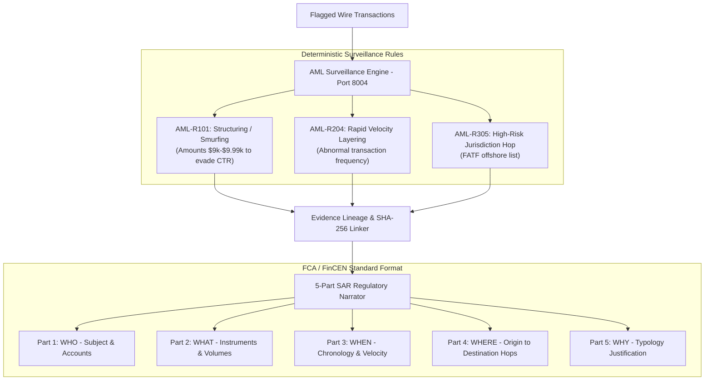

# JPMC Trade AML Explainer API: Automated SAR & Trade Anomaly Narrator

[](https://fastapi.tiangolo.com)
[](https://python.org)
[](https://docs.pydantic.dev)
[](https://www.fca.org.uk)

An enterprise Financial Crime & AML (Anti-Money Laundering) surveillance microservice built for **JPMorgan Chase's LLM Suite**. It couples deterministic rule verification for financial crime typologies (Structuring, Velocity Spikes, Offshore Jurisdictions) with an automated **5-part regulatory Suspicious Activity Report (SAR)** narrative generator backed by cryptographic transaction evidence lineage.

---

## Architecture Overview



---

## The 5-Part Regulatory SAR Standard

Under UK **FCA / NCA** and US **FinCEN** regulations, every filed Suspicious Activity Report must answer five foundational statutory questions:
1. **WHO**: Subject entity, business nature, and account details.
2. **WHAT**: Financial instruments, aggregate amounts, and structuring behavior.
3. **WHEN**: Chronological timeframe and timestamp distribution.
4. **WHERE**: Domestic and cross-border geographical route tracking.
5. **WHY**: Explicit justification citing violated surveillance rules (e.g. deliberate structuring below currency reporting thresholds).

---

## API Endpoints Reference

| Method | Endpoint | Description |
| :--- | :--- | :--- |
| `GET` | `/health` | Service health status and active surveillance rule codes |
| `GET` | `/api/v1/aml/demo` | Executes triage and SAR generation on a realistic structuring alert batch |
| `POST` | `/api/v1/aml/triage-alert` | Evaluates transactions against AML rules and assigns triage priority |
| `POST` | `/api/v1/aml/generate-sar` | Generates a complete 5-part regulatory SAR narrative with evidence lineage |

---

## Quickstart

```bash
# Run test suite
python JPMC_TradeAML_Explainer_API/test_api.py

# Launch FastAPI microservice on Port 8004
uvicorn JPMC_TradeAML_Explainer_API.main:app --host 0.0.0.0 --port 8004 --reload
```
Interactive OpenAPI Swagger docs will be live at: **`http://127.0.0.1:8004/docs`**.

---

## 🎯 JPMC Senior Associate Interview Defense Guide

### Question 1: *"Why can't an LLM simply write the entire SAR narrative autonomously without deterministic rules?"*
> **Answer**:
> *"Submitting a hallucinatory or legally inaccurate Suspicious Activity Report to regulators like the UK FCA or FinCEN can result in severe consent orders or failure-to-file penalties against the bank.
> In my **JPMC Trade AML Explainer API**, I enforced a hybrid architecture: deterministic rules engines evaluate mathematical structuring and velocity thresholds first.
> The narrative generator is strictly constrained to synthesize explanations only from the flagged rule outputs and transaction evidence hashes. This guarantees zero hallucinated transaction numbers or non-existent counterparties."*

### Question 2: *"How does this reduce operational overhead for JPMorgan's financial crime compliance analysts?"*
> **Answer**:
> *"AML analysts at tier-1 banks spend up to 45 minutes manually drafting the narrative section for each escalated alert.
> By automating the generation of the standardized 5-part SAR structure with immutable transaction hashes in sub-second time, this microservice acts as an intelligent copilot inside JPMorgan's LLM Suite, reducing narrative drafting time from 45 minutes to under 2 minutes for human sign-off."*
